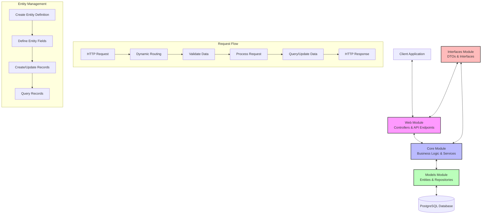

# ModelHub: Dynamic Data Modeling Platform

## Table of Contents

- [Overview](#overview)
- [Key Features](#key-features)
- [Quick Start Guide](#quick-start-guide)
  - [Installation](#installation)
  - [Creating Your First Entity](#creating-your-first-entity)
  - [Adding Fields](#adding-fields)
  - [Working with Records](#working-with-records)
  - [Querying Data](#querying-data)
- [Tutorial: Building a Complete Application](#tutorial-building-a-complete-application)
  - [Step 1: Setting Up Your Data Model](#step-1-setting-up-your-data-model)
  - [Step 2: Creating Relationships](#step-2-creating-relationships)
  - [Step 3: Implementing Business Logic](#step-3-implementing-business-logic)
  - [Step 4: Building the API Layer](#step-4-building-the-api-layer)
- [Usage Examples](#usage-examples)
  - [Entity Management](#entity-management)
  - [Field Operations](#field-operations)
  - [Dynamic API Usage](#dynamic-api-usage)
  - [Advanced Queries](#advanced-queries)
- [API Reference](#api-reference)
  - [Entity Endpoints](#entity-endpoints)
  - [Field Endpoints](#field-endpoints)
  - [Dynamic API Endpoints](#dynamic-api-endpoints)
  - [Query Language Reference](#query-language-reference)
  - [Field Types and Validation](#field-types-and-validation)
- [Architecture](#architecture)
  - [Module Structure](#module-structure)
  - [Data Flow](#data-flow)
  - [Database Schema](#database-schema)
- [Technology Stack](#technology-stack)
- [Development Guide](#development-guide)
  - [Prerequisites](#prerequisites)
  - [Setup and Configuration](#setup-and-configuration)
  - [Building and Running](#building-and-running)
  - [Testing](#testing)
- [Deployment](#deployment)
  - [Docker Deployment](#docker-deployment)
  - [Kubernetes Deployment](#kubernetes-deployment)
  - [Configuration Options](#configuration-options)
- [Troubleshooting](#troubleshooting)
  - [Common Issues](#common-issues)
  - [Debugging Tips](#debugging-tips)
  - [Performance Optimization](#performance-optimization)
- [Contributing](#contributing)

## Overview

ModelHub is a reactive, metadata-driven microservice that enables dynamic creation and management of data models at runtime without requiring schema changes. It allows you to define custom entities with flexible fields and provides powerful query capabilities through a RESTful API.

**Why ModelHub?** Traditional systems require downtime and migrations to modify data structures. ModelHub provides a flexible, schema-less approach that allows:

- **No-code model creation**: Define new data models without IT intervention
- **Zero-downtime evolution**: Extend data models without database schema changes
- **Structured data storage**: Store and query data with full validation
- **Future-proof systems**: Evolve your application without breaking changes
- **Dynamic API generation**: Automatically expose RESTful endpoints for your models

## Key Features

- **Dynamic Entity Definitions**: Create and manage data models at runtime
- **Custom Field Definitions**: Define fields with various data types (string, number, boolean, date, etc.)
- **Schema Validation**: Automatic validation of records against their entity schema
- **SQL-like Query Capabilities**: Powerful filtering with SQL-like syntax
- **Dynamic API Endpoints**: Automatically generated RESTful endpoints for each entity
- **Reactive Architecture**: Non-blocking, reactive programming with Spring WebFlux
- **Comprehensive Validation**: Type checking and constraint validation for all data types including arrays, enums, and references
- **Audit Tracking**: Built-in created/updated timestamps for all records
- **Performance Optimization**: Efficient caching of entity definitions and fields for improved response times

## Quick Start Guide

### Installation

Get ModelHub up and running in minutes:

```bash
# 1. Clone the repository
git clone https://github.com/firefly-oss/common-platform-modelhub.git
cd common-platform-modelhub

# 2. Start PostgreSQL (Docker)
docker run --name postgres -e POSTGRES_PASSWORD=postgres -p 5432:5432 -d postgres:14

# 3. Build and run the application
mvn clean install
java -jar common-platform-modelhub-web/target/common-platform-modelhub.jar
```

### Creating Your First Entity

Let's create a "customer" entity to store customer information:

```bash
# Create a customer entity
curl -X POST http://localhost:8080/api/v1/entities \
  -H "Content-Type: application/json" \
  -d '{
    "name": "customer",
    "description": "Customer information",
    "active": true
  }'

# Response will include the entity ID
# {
# "id": "3fa85f64-5717-4562-b3fc-2c963f66afa6",
# "name": "customer",
# "description": "Customer information",
# "active": true,
# "createdAt": "2023-06-15T10:30:00",
# "updatedAt": "2023-06-15T10:30:00"
# }

# Save the entity ID for later use
ENTITY_ID="3fa85f64-5717-4562-b3fc-2c963f66afa6"
```

### Adding Fields

Now, let's define the structure of our customer entity by adding fields:

```bash
# Add first name field
curl -X POST http://localhost:8080/api/v1/fields \
  -H "Content-Type: application/json" \
  -d '{
    "entityId": "'$ENTITY_ID'",
    "fieldKey": "firstName",
    "fieldLabel": "First Name",
    "fieldType": "string",
    "required": true,
    "orderIndex": 1
  }'

# Add last name field
curl -X POST http://localhost:8080/api/v1/fields \
  -H "Content-Type: application/json" \
  -d '{
    "entityId": "'$ENTITY_ID'",
    "fieldKey": "lastName",
    "fieldLabel": "Last Name",
    "fieldType": "string",
    "required": true,
    "orderIndex": 2
  }'

# Add email field
curl -X POST http://localhost:8080/api/v1/fields \
  -H "Content-Type: application/json" \
  -d '{
    "entityId": "'$ENTITY_ID'",
    "fieldKey": "email",
    "fieldLabel": "Email Address",
    "fieldType": "email",
    "required": true,
    "orderIndex": 3
  }'

# Add phone field
curl -X POST http://localhost:8080/api/v1/fields \
  -H "Content-Type: application/json" \
  -d '{
    "entityId": "'$ENTITY_ID'",
    "fieldKey": "phone",
    "fieldLabel": "Phone Number",
    "fieldType": "phone",
    "required": false,
    "orderIndex": 4
  }'
```

### Working with Records

Now that we have our entity structure defined, we can create, retrieve, update, and delete customer records using the dynamic API:

```bash
# Create a new customer record
curl -X POST http://localhost:8080/api/dynamic/customers \
  -H "Content-Type: application/json" \
  -d '{
    "firstName": "John",
    "lastName": "Doe",
    "email": "john.doe@example.com",
    "phone": "555-123-4567"
  }'

# Get all customers
curl -X GET http://localhost:8080/api/dynamic/customers

# Get a specific customer by ID
curl -X GET http://localhost:8080/api/dynamic/customers/3fa85f64-5717-4562-b3fc-2c963f66afa7

# Update a customer
curl -X PUT http://localhost:8080/api/dynamic/customers/3fa85f64-5717-4562-b3fc-2c963f66afa7 \
  -H "Content-Type: application/json" \
  -d '{
    "firstName": "John",
    "lastName": "Smith",
    "email": "john.smith@example.com",
    "phone": "555-123-4567"
  }'

# Delete a customer
curl -X DELETE http://localhost:8080/api/dynamic/customers/3fa85f64-5717-4562-b3fc-2c963f66afa7
```

### Querying Data

ModelHub provides powerful SQL-like query capabilities:

```bash
# Find customers with a specific last name
curl -X POST http://localhost:8080/api/dynamic/customers/query \
  -H "Content-Type: application/json" \
  -d '{
    "queryString": "lastName = '\''Smith'\''"
  }'

# Find customers with email from a specific domain
curl -X POST http://localhost:8080/api/dynamic/customers/query \
  -H "Content-Type: application/json" \
  -d '{
    "queryString": "email LIKE '\''%example.com%'\''"
  }'

# Find customers with complex conditions
curl -X POST http://localhost:8080/api/dynamic/customers/query \
  -H "Content-Type: application/json" \
  -d '{
    "queryString": "lastName = '\''Smith'\'' AND (email LIKE '\''%example.com%'\'' OR phone IS NOT NULL)",
    "page": 0,
    "size": 20
  }'
```

## Tutorial: Building a Complete Application

This section walks you through building a complete application using ModelHub.

### Step 1: Setting Up Your Data Model

Let's build a product catalog system with products, categories, and inventory:

```bash
# 1. Create the category entity
curl -X POST http://localhost:8080/api/v1/entities \
  -H "Content-Type: application/json" \
  -d '{
    "name": "category",
    "description": "Product categories",
    "active": true
  }'

# Save the category entity ID
CATEGORY_ENTITY_ID="the-returned-id"

# 2. Add fields to the category entity
curl -X POST http://localhost:8080/api/v1/fields \
  -H "Content-Type: application/json" \
  -d '{
    "entityId": "'$CATEGORY_ENTITY_ID'",
    "fieldKey": "name",
    "fieldLabel": "Category Name",
    "fieldType": "string",
    "required": true,
    "orderIndex": 1
  }'

curl -X POST http://localhost:8080/api/v1/fields \
  -H "Content-Type: application/json" \
  -d '{
    "entityId": "'$CATEGORY_ENTITY_ID'",
    "fieldKey": "description",
    "fieldLabel": "Description",
    "fieldType": "string",
    "required": false,
    "orderIndex": 2
  }'

# 3. Create the product entity
curl -X POST http://localhost:8080/api/v1/entities \
  -H "Content-Type: application/json" \
  -d '{
    "name": "product",
    "description": "Product catalog",
    "active": true
  }'

# Save the product entity ID
PRODUCT_ENTITY_ID="the-returned-id"

# 4. Add fields to the product entity
curl -X POST http://localhost:8080/api/v1/fields \
  -H "Content-Type: application/json" \
  -d '{
    "entityId": "'$PRODUCT_ENTITY_ID'",
    "fieldKey": "name",
    "fieldLabel": "Product Name",
    "fieldType": "string",
    "required": true,
    "orderIndex": 1
  }'

curl -X POST http://localhost:8080/api/v1/fields \
  -H "Content-Type: application/json" \
  -d '{
    "entityId": "'$PRODUCT_ENTITY_ID'",
    "fieldKey": "description",
    "fieldLabel": "Description",
    "fieldType": "string",
    "required": false,
    "orderIndex": 2
  }'

curl -X POST http://localhost:8080/api/v1/fields \
  -H "Content-Type: application/json" \
  -d '{
    "entityId": "'$PRODUCT_ENTITY_ID'",
    "fieldKey": "price",
    "fieldLabel": "Price",
    "fieldType": "number",
    "required": true,
    "orderIndex": 3
  }'

curl -X POST http://localhost:8080/api/v1/fields \
  -H "Content-Type: application/json" \
  -d '{
    "entityId": "'$PRODUCT_ENTITY_ID'",
    "fieldKey": "categoryId",
    "fieldLabel": "Category ID",
    "fieldType": "string",
    "required": true,
    "orderIndex": 4
  }'

curl -X POST http://localhost:8080/api/v1/fields \
  -H "Content-Type: application/json" \
  -d '{
    "entityId": "'$PRODUCT_ENTITY_ID'",
    "fieldKey": "inStock",
    "fieldLabel": "In Stock",
    "fieldType": "boolean",
    "required": true,
    "orderIndex": 5
  }'
```

### Step 2: Creating Relationships

Now let's create some categories and products with relationships:

```bash
# 1. Create categories
curl -X POST http://localhost:8080/api/dynamic/categories \
  -H "Content-Type: application/json" \
  -d '{
    "name": "Electronics",
    "description": "Electronic devices and accessories"
  }'

# Save the category ID
ELECTRONICS_ID="the-returned-id"

curl -X POST http://localhost:8080/api/dynamic/categories \
  -H "Content-Type: application/json" \
  -d '{
    "name": "Furniture",
    "description": "Home and office furniture"
  }'

# Save the category ID
FURNITURE_ID="the-returned-id"

# 2. Create products in the Electronics category
curl -X POST http://localhost:8080/api/dynamic/products \
  -H "Content-Type: application/json" \
  -d '{
    "name": "Smartphone X",
    "description": "Latest smartphone with advanced features",
    "price": 999.99,
    "categoryId": "'$ELECTRONICS_ID'",
    "inStock": true
  }'

curl -X POST http://localhost:8080/api/dynamic/products \
  -H "Content-Type: application/json" \
  -d '{
    "name": "Laptop Pro",
    "description": "High-performance laptop for professionals",
    "price": 1499.99,
    "categoryId": "'$ELECTRONICS_ID'",
    "inStock": true
  }'

# 3. Create products in the Furniture category
curl -X POST http://localhost:8080/api/dynamic/products \
  -H "Content-Type: application/json" \
  -d '{
    "name": "Office Desk",
    "description": "Spacious desk for home office",
    "price": 299.99,
    "categoryId": "'$FURNITURE_ID'",
    "inStock": true
  }'
```

### Step 3: Implementing Business Logic

Let's implement some business logic using queries:

```bash
# 1. Find all products in the Electronics category
curl -X POST http://localhost:8080/api/dynamic/products/query \
  -H "Content-Type: application/json" \
  -d '{
    "queryString": "categoryId = '\''$ELECTRONICS_ID'\''"
  }'

# 2. Find all products over $1000
curl -X POST http://localhost:8080/api/dynamic/products/query \
  -H "Content-Type: application/json" \
  -d '{
    "queryString": "price > 1000"
  }'

# 3. Find all in-stock electronics products, sorted by price
curl -X POST http://localhost:8080/api/dynamic/products/query \
  -H "Content-Type: application/json" \
  -d '{
    "queryString": "categoryId = '\''$ELECTRONICS_ID'\'' AND inStock = true ORDER BY price DESC"
  }'
```

### Step 4: Building the API Layer

Now let's create a simple inventory management API:

```bash
# 1. Update product stock status
curl -X PUT http://localhost:8080/api/dynamic/products/3fa85f64-5717-4562-b3fc-2c963f66afa7 \
  -H "Content-Type: application/json" \
  -d '{
    "name": "Laptop Pro",
    "description": "High-performance laptop for professionals",
    "price": 1499.99,
    "categoryId": "'$ELECTRONICS_ID'",
    "inStock": false
  }'

# 2. Get all out-of-stock products
curl -X POST http://localhost:8080/api/dynamic/products/query \
  -H "Content-Type: application/json" \
  -d '{
    "queryString": "inStock = false"
  }'

# 3. Count products by category
curl -X POST http://localhost:8080/api/dynamic/products/query \
  -H "Content-Type: application/json" \
  -d '{
    "queryString": "categoryId = '\''$ELECTRONICS_ID'\''"
  }'
# Check the "totalCount" field in the response
```

## Usage Examples

### Entity Management

```bash
# Create an entity
curl -X POST http://localhost:8080/api/v1/entities \
  -H "Content-Type: application/json" \
  -d '{
    "name": "employee",
    "description": "Employee records",
    "active": true
  }'

# Get all entities
curl -X GET http://localhost:8080/api/v1/entities

# Get entity by ID
curl -X GET http://localhost:8080/api/v1/entities/3fa85f64-5717-4562-b3fc-2c963f66afa6

# Get entity by name
curl -X GET http://localhost:8080/api/v1/entities/name/employee

# Get entity schema (entity + fields)
curl -X GET http://localhost:8080/api/v1/entities/employee/schema

# Update an entity
curl -X PUT http://localhost:8080/api/v1/entities/3fa85f64-5717-4562-b3fc-2c963f66afa6 \
  -H "Content-Type: application/json" \
  -d '{
    "name": "employee",
    "description": "Updated employee records description",
    "active": true
  }'

# Delete an entity (this will also delete all fields and records)
curl -X DELETE http://localhost:8080/api/v1/entities/3fa85f64-5717-4562-b3fc-2c963f66afa6
```

### Field Operations

```bash
# Create a field
curl -X POST http://localhost:8080/api/v1/fields \
  -H "Content-Type: application/json" \
  -d '{
    "entityId": "3fa85f64-5717-4562-b3fc-2c963f66afa6",
    "fieldKey": "salary",
    "fieldLabel": "Salary",
    "fieldType": "number",
    "required": true,
    "orderIndex": 5
  }'

# Get all fields for an entity
curl -X GET http://localhost:8080/api/v1/fields/entity/3fa85f64-5717-4562-b3fc-2c963f66afa6

# Get field by ID
curl -X GET http://localhost:8080/api/v1/fields/3fa85f64-5717-4562-b3fc-2c963f66afa7

# Update a field
curl -X PUT http://localhost:8080/api/v1/fields/3fa85f64-5717-4562-b3fc-2c963f66afa7 \
  -H "Content-Type: application/json" \
  -d '{
    "entityId": "3fa85f64-5717-4562-b3fc-2c963f66afa6",
    "fieldKey": "salary",
    "fieldLabel": "Annual Salary",
    "fieldType": "number",
    "required": true,
    "orderIndex": 5
  }'

# Delete a field
curl -X DELETE http://localhost:8080/api/v1/fields/3fa85f64-5717-4562-b3fc-2c963f66afa7
```

### Dynamic API Usage

ModelHub provides dynamic API endpoints for each entity in the system:

```bash
# Get all records for an entity
curl -X GET http://localhost:8080/api/dynamic/employees

# Get a specific record
curl -X GET http://localhost:8080/api/dynamic/employees/3fa85f64-5717-4562-b3fc-2c963f66afa7

# Create a new record
curl -X POST http://localhost:8080/api/dynamic/employees \
  -H "Content-Type: application/json" \
  -d '{
    "firstName": "Jane",
    "lastName": "Doe",
    "email": "jane.doe@example.com",
    "department": "Engineering",
    "salary": 85000
  }'

# Update a record
curl -X PUT http://localhost:8080/api/dynamic/employees/3fa85f64-5717-4562-b3fc-2c963f66afa7 \
  -H "Content-Type: application/json" \
  -d '{
    "firstName": "Jane",
    "lastName": "Smith",
    "email": "jane.smith@example.com",
    "department": "Engineering",
    "salary": 90000
  }'

# Delete a record
curl -X DELETE http://localhost:8080/api/dynamic/employees/3fa85f64-5717-4562-b3fc-2c963f66afa7

# Query records
curl -X POST http://localhost:8080/api/dynamic/employees/query \
  -H "Content-Type: application/json" \
  -d '{
    "queryString": "department = '\''Engineering'\'' AND salary > 80000"
  }'
```

### Advanced Queries

ModelHub supports a rich query language for filtering and retrieving records:

```bash
# Basic equality
curl -X POST http://localhost:8080/api/dynamic/employees/query \
  -H "Content-Type: application/json" \
  -d '{
    "queryString": "department = '\''Engineering'\''"
  }'

# Numeric comparisons
curl -X POST http://localhost:8080/api/dynamic/employees/query \
  -H "Content-Type: application/json" \
  -d '{
    "queryString": "salary > 75000 AND salary <= 100000"
  }'

# Text search with LIKE
curl -X POST http://localhost:8080/api/dynamic/employees/query \
  -H "Content-Type: application/json" \
  -d '{
    "queryString": "email LIKE '\''%example.com%'\''"
  }'

# Multiple conditions with AND/OR
curl -X POST http://localhost:8080/api/dynamic/employees/query \
  -H "Content-Type: application/json" \
  -d '{
    "queryString": "(department = '\''Engineering'\'' OR department = '\''Marketing'\'') AND salary > 70000"
  }'

# Sorting
curl -X POST http://localhost:8080/api/dynamic/employees/query \
  -H "Content-Type: application/json" \
  -d '{
    "queryString": "ORDER BY salary DESC, lastName ASC"
  }'

# Pagination
curl -X POST http://localhost:8080/api/dynamic/employees/query \
  -H "Content-Type: application/json" \
  -d '{
    "queryString": "department = '\''Engineering'\''",
    "page": 0,
    "size": 10
  }'

# NULL checks
curl -X POST http://localhost:8080/api/dynamic/employees/query \
  -H "Content-Type: application/json" \
  -d '{
    "queryString": "department IS NOT NULL AND manager IS NULL"
  }'
```

## API Reference

### Entity Endpoints

| Method | Endpoint | Description |
|--------|----------|-------------|
| GET | `/api/v1/entities` | Get all entities |
| GET | `/api/v1/entities/{id}` | Get entity by ID |
| GET | `/api/v1/entities/name/{name}` | Get entity by name |
| GET | `/api/v1/entities/{name}/schema` | Get entity schema with fields |
| POST | `/api/v1/entities` | Create a new entity |
| PUT | `/api/v1/entities/{id}` | Update an entity |
| DELETE | `/api/v1/entities/{id}` | Delete an entity |

### Field Endpoints

| Method | Endpoint | Description |
|--------|----------|-------------|
| GET | `/api/v1/fields/entity/{entityId}` | Get all fields for an entity |
| GET | `/api/v1/fields/{id}` | Get field by ID |
| POST | `/api/v1/fields` | Create a new field |
| PUT | `/api/v1/fields/{id}` | Update a field |
| DELETE | `/api/v1/fields/{id}` | Delete a field |

### Dynamic API Endpoints

ModelHub provides dynamic API endpoints under the `/api/dynamic/` path prefix:

| Method | Endpoint | Description |
|--------|----------|-------------|
| GET | `/api/dynamic/{entityName}` | Get all records for an entity |
| GET | `/api/dynamic/{entityName}/{id}` | Get record by ID |
| POST | `/api/dynamic/{entityName}` | Create a new record |
| PUT | `/api/dynamic/{entityName}/{id}` | Update a record |
| DELETE | `/api/dynamic/{entityName}/{id}` | Delete a record |
| POST | `/api/dynamic/{entityName}/query` | Query records with SQL-like capabilities |

Where `{entityName}` is the name of your entity (e.g., "customers", "products", etc.)

### Query Language Reference

ModelHub supports a SQL-like query language for filtering records:

| Operator | SQL Syntax | Description |
|----------|------------|-------------|
| Equals | `=` or `eq` | Field equals value |
| Not Equals | `!=`, `<>` or `neq` | Field does not equal value |
| Greater Than | `>` or `gt` | Field greater than value |
| Greater Than/Equal | `>=` or `gte` | Field greater than or equal to value |
| Less Than | `<` or `lt` | Field less than value |
| Less Than/Equal | `<=` or `lte` | Field less than or equal to value |
| Contains | `LIKE` or `contains` | Field contains substring |
| Starts With | `startsWith` | Field starts with substring |
| Ends With | `endsWith` | Field ends with substring |
| In List | `IN` or `in` | Field value is in list |
| Not In List | `NOT IN` or `notIn` | Field value is not in list |
| Is Null | `IS NULL` or `isNull` | Field is null |
| Is Not Null | `IS NOT NULL` or `isNotNull` | Field is not null |

### Field Types and Validation

ModelHub supports a variety of field types with comprehensive validation:

| Field Type | Description | Validation |
|------------|-------------|------------|
| `string` | Text data | Validates that the value is a string |
| `number` | Numeric data (float/double) | Validates that the value is a number or can be parsed as one |
| `integer` | Integer data | Validates that the value is an integer or can be parsed as one |
| `boolean` | Boolean data (true/false) | Validates that the value is a boolean or "true"/"false" string |
| `date` | Date without time | Validates ISO format (YYYY-MM-DD) |
| `datetime` | Date with time | Validates ISO format datetime |
| `email` | Email address | Validates email format using regex |
| `phone` | Phone number | Validates phone format using regex |
| `url` | URL/web address | Validates URL format using regex |
| `enum` | Value from predefined list | Validates that value is in the allowed options list |
| `object` | Nested object/map | Validates that value is a map/object |
| `array` | List of values | Validates that value is an array and can validate each item based on itemType |
| `reference` | Reference to another entity | Validates UUID format |

#### Advanced Validation Features

- **Required Fields**: Fields marked as required are validated to ensure they are present and not null
- **Array Item Validation**: For array fields, each item can be validated against a specified type
- **Enum Validation**: Enum fields are validated against a list of allowed values
- **Reference Validation**: Reference fields are validated to ensure they contain valid UUIDs
- **Custom Error Messages**: Detailed error messages for each validation failure

## Architecture

ModelHub is designed with a modular, reactive architecture that enables high scalability and flexibility.

### System Overview



The diagram above illustrates the architecture and data flow of ModelHub. The system consists of four main modules that work together to provide dynamic data modeling capabilities.

### Module Structure

The project is structured into multiple modules:

- **common-platform-modelhub-interfaces**: Contains DTOs and interfaces
- **common-platform-modelhub-models**: Contains database entities and repositories
- **common-platform-modelhub-core**: Contains business logic and services
- **common-platform-modelhub-web**: Contains REST controllers and web configuration

```
common-platform-modelhub/
├── common-platform-modelhub-interfaces/  # DTOs and interfaces
├── common-platform-modelhub-models/      # Database entities and repositories
├── common-platform-modelhub-core/        # Business logic and services
└── common-platform-modelhub-web/         # REST controllers and web configuration
```

### Data Flow

1. **Request Handling**: Incoming HTTP requests are handled by controllers in the web module
2. **Service Layer**: Business logic is processed in the core module's services
3. **Data Access**: The models module handles database interactions through reactive repositories
4. **Response Mapping**: DTOs from the interfaces module are used for API responses

### Database Schema

The core database schema consists of three main tables:

1. **virtual_entity**: Stores entity definitions
   - id (UUID): Primary key
   - name (String): Entity name
   - description (String): Entity description
   - active (Boolean): Entity status
   - audit fields (created_at, updated_at, etc.)

2. **virtual_entity_field**: Stores dynamic field definitions per entity
   - id (UUID): Primary key
   - entity_id (UUID): Foreign key to virtual_entity
   - field_key (String): Field identifier
   - field_label (String): Display name
   - field_type (String): Data type (string, number, boolean, etc.)
   - required (Boolean): Whether field is required
   - options (JSONB): Additional field options
   - order_index (Integer): Display order
   - audit fields (created_at, updated_at, etc.)

3. **virtual_entity_record**: Stores structured records as JSON
   - id (UUID): Primary key
   - entity_id (UUID): Foreign key to virtual_entity
   - payload (JSONB): Record data
   - audit fields (created_at, updated_at, etc.)

## Technology Stack

- **Java 25**: Latest LTS version with virtual threads support
- **Spring Boot 3**: Modern application framework
- **Spring WebFlux**: Reactive programming model
- **Spring Data R2DBC**: Reactive database access
- **PostgreSQL with JSONB**: For storing structured data
- **Flyway**: Database migration and versioning
- **MapStruct**: For DTO Entity mapping
- **Jackson**: For JSON serialization
- **Swagger/OpenAPI**: API documentation
- **Maven**: Build and dependency management

## Development Guide

### Prerequisites

- Java 25
- PostgreSQL 12+
- Maven 3.8+
- Docker (optional)

### Setup and Configuration

#### 1. Install Dependencies

```bash
# Install Java 25 (using SDKMan)
sdk install java 21-open

# Install PostgreSQL (or use Docker as shown in Quick Start)
# macOS
brew install postgresql
# Ubuntu/Debian
sudo apt-get install postgresql

# Create database
createdb modelhub
```

#### 2. Clone and Configure

```bash
# Clone repository
git clone https://github.com/firefly/common-platform-modelhub.git
cd common-platform-modelhub

# Configure database connection
# Edit application.yaml or set environment variables:
export DB_HOST=localhost
export DB_PORT=5432
export DB_NAME=modelhub
export DB_USERNAME=postgres
export DB_PASSWORD=postgres
export DB_SSL_MODE=disable
```

#### 3. IDE Setup

- **IntelliJ IDEA**: Import as Maven project
- **VS Code**: Install Java Extension Pack
- **Eclipse**: Import as Maven project

### Building and Running

```bash
# Build the project
mvn clean install

# Run with Maven
mvn spring-boot:run -pl common-platform-modelhub-web

# Or run the JAR
java -jar common-platform-modelhub-web/target/common-platform-modelhub.jar

# Run with specific profile
java -jar -Dspring.profiles.active=dev common-platform-modelhub-web/target/common-platform-modelhub.jar
```

### Testing

```bash
# Run all tests
mvn test

# Run tests for a specific module
mvn test -pl common-platform-modelhub-core

# Run with coverage report
mvn test jacoco:report
```

## Deployment

ModelHub can be deployed in various environments using Docker or Kubernetes.

### Docker Deployment

```bash
# Build Docker image
docker build -t modelhub .

# Run container
docker run -p 8080:8080 \
  -e DB_HOST=your-db-host \
  -e DB_PORT=5432 \
  -e DB_NAME=modelhub \
  -e DB_USERNAME=postgres \
  -e DB_PASSWORD=your-password \
  modelhub
```

Example docker-compose.yml:

```yaml
version: '3.8'
services:
  modelhub:
    image: modelhub:latest
    ports:
      - "8080:8080"
    environment:
      - SPRING_PROFILES_ACTIVE=prod
      - DB_HOST=postgres
      - DB_PORT=5432
      - DB_NAME=modelhub
      - DB_USERNAME=postgres
      - DB_PASSWORD=postgres
    depends_on:
      - postgres
    restart: unless-stopped

  postgres:
    image: postgres:14
    ports:
      - "5432:5432"
    environment:
      - POSTGRES_DB=modelhub
      - POSTGRES_USER=postgres
      - POSTGRES_PASSWORD=postgres
    volumes:
      - postgres-data:/var/lib/postgresql/data
    restart: unless-stopped

volumes:
  postgres-data:
```

### Kubernetes Deployment

Example Kubernetes deployment:

```yaml
apiVersion: apps/v1
kind: Deployment
metadata:
  name: modelhub
spec:
  replicas: 2
  selector:
    matchLabels:
      app: modelhub
  template:
    metadata:
      labels:
        app: modelhub
    spec:
      containers:
      - name: modelhub
        image: modelhub:latest
        ports:
        - containerPort: 8080
        env:
        - name: SPRING_PROFILES_ACTIVE
          value: "prod"
        - name: DB_HOST
          valueFrom:
            secretKeyRef:
              name: modelhub-db-credentials
              key: host
        - name: DB_PORT
          valueFrom:
            secretKeyRef:
              name: modelhub-db-credentials
              key: port
        - name: DB_NAME
          valueFrom:
            secretKeyRef:
              name: modelhub-db-credentials
              key: database
        - name: DB_USERNAME
          valueFrom:
            secretKeyRef:
              name: modelhub-db-credentials
              key: username
        - name: DB_PASSWORD
          valueFrom:
            secretKeyRef:
              name: modelhub-db-credentials
              key: password
        resources:
          limits:
            memory: "512Mi"
            cpu: "500m"
          requests:
            memory: "256Mi"
            cpu: "250m"
        readinessProbe:
          httpGet:
            path: /actuator/health/readiness
            port: 8080
          initialDelaySeconds: 30
          periodSeconds: 10
        livenessProbe:
          httpGet:
            path: /actuator/health/liveness
            port: 8080
          initialDelaySeconds: 60
          periodSeconds: 15
```

### Configuration Options

ModelHub can be configured using environment variables or application properties:

| Parameter | Description | Default |
|-----------|-------------|---------|
| `DB_HOST` | Database hostname | localhost |
| `DB_PORT` | Database port | 5432 |
| `DB_NAME` | Database name | modelhub |
| `DB_USERNAME` | Database username | postgres |
| `DB_PASSWORD` | Database password | postgres |
| `DB_SSL_MODE` | SSL mode for database connection | disable |
| `SPRING_PROFILES_ACTIVE` | Active Spring profile | dev |
| `SERVER_PORT` | Application port | 8080 |

## Troubleshooting

### Common Issues

#### Database Connection Problems

| Problem | Solution |
|---------|----------|
| Connection refused | • Check if PostgreSQL is running<br>• Verify host and port settings<br>• Check firewall rules |
| Authentication failed | • Verify username and password<br>• Check database user permissions |
| Database not found | • Ensure the database exists (`createdb modelhub`)<br>• Check DB_NAME environment variable |
| SSL issues | • Set `DB_SSL_MODE=disable` for local development<br>• Configure proper certificates for production |

#### API Errors

| Error | Solution |
|-------|----------|
| 400 Bad Request | • Check request payload format<br>• Verify required fields are present<br>• Ensure field types match schema |
| 404 Not Found | • Verify entity/field/record IDs exist<br>• Check URL path parameters |
| 500 Internal Server Error | • Check application logs<br>• Verify database connection<br>• Ensure sufficient memory/resources |

#### Query Issues

| Issue | Solution |
|-------|----------|
| No results returned | • Check entity ID is correct<br>• Verify field names in query match schema<br>• Check query syntax for SQL-like queries |
| Query syntax errors | • Ensure proper quoting of string values<br>• Check parentheses are balanced<br>• Verify operator syntax (=, >, <, etc.) |
| Performance problems | • Add pagination parameters (page, size)<br>• Add indexes to frequently queried fields<br>• Optimize complex queries |

### Debugging Tips

#### Enable Debug Logging

```bash
# Set environment variable
export LOGGING_LEVEL_COM_CATALIS=DEBUG

# Or in application.yaml
logging:
  level:
    com.firefly: DEBUG
```

#### Check Application Health

```bash
# Get application health status
curl http://localhost:8080/actuator/health

# Get detailed health information
curl http://localhost:8080/actuator/health/details
```

#### View SQL Queries

To see actual SQL queries being executed:

```yaml
# In application.yaml
logging:
  level:
    org.springframework.r2dbc: DEBUG
```

### Performance Optimization

- **Entity Definition Caching**: ModelHub implements an in-memory cache for entity definitions and field schemas, significantly reducing database queries and improving response times
  - Time-based cache expiration (5 minutes by default)
  - Automatic cache invalidation on entity/field updates
  - Separate caches for entities (by ID and name) and fields
- **Pagination**: Use pagination for large result sets to reduce memory usage and improve response times
- **Database Indexing**: Create appropriate indexes in PostgreSQL for frequently queried fields
- **Projection Queries**: Use projection queries to return only needed fields
- **Memory Management**: Monitor memory usage and adjust JVM settings if needed
- **Query Optimization**: Use the SQL query parser to optimize complex queries

## Contributing

We welcome contributions to the ModelHub project!

### Development Workflow

1. Fork the repository
2. Create a feature branch: `git checkout -b feature/your-feature-name`
3. Commit your changes: `git commit -am 'Add some feature'`
4. Push to the branch: `git push origin feature/your-feature-name`
5. Submit a pull request

### Coding Standards

- Follow Java code conventions
- Write unit tests for new features
- Update documentation for API changes
- Use meaningful commit messages

### Pull Request Process

1. Ensure all tests pass
2. Update the README.md with details of changes if appropriate
3. The PR will be merged once it has been reviewed and approved
